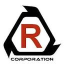
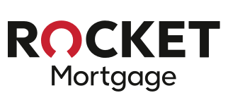

# Exploring DocDBs

Feel free to [skip the story](#goals) if you wish.

## Background
Professor Oak was sitting at his computer when he was surprised to receive a call from Professor Birch. 


*Professor Birch was always late to class*

"Birchie! How's the Hoenn region?"

"Quite pleasant, Samuel. How's Johto?"

They chatted pleasantly for a few minutes. Then Professor Oak said, "What can I do for you? Anything going on?"

"Well, as it turns out, I'm joining a startup--a company called Rocket Pokemon, they're sort of an outgrowth of the same folks that do mortgages and loans--and I could use your help."




*Are they the same company? You decide for yourself.*

Professor Oak was confused. "I'm happy for you, Birchie, but why...?"

"Why call you? Because! I want your help! We want to start running some experiments where we put thousands of Pokemon into battles--"


Professor Oak gasped. "Birchie! You're talking Pokemon WAR?!?"

"No, no! No. We want to *simulate* those battles. We think it'll be useful for research."

"Oh!" Professor Oak was relieved. "Well, how can I help?"

Professor Birch smiled. "I was hoping you'd ask! You see, we need your Pokemon database to be in our database."

Professor Oak started to get a bad feeling in his stomach. "Well, I'm happy to share my SQL database with you..."

"No, I'm sorry Samuel, but we find that a SQL database can't handle the millions of simulations we're going to run. We were hoping you could port it into a document database...? If you could, maybe, put the data into MongoDB...?"

Suddenly Professor Oak wanted to see Team Rocket Corp in a familiar pose.


## Goals
Using the CSV file provided, import the data into a MongoDB database and make sure it is usable from a Python program (which will simulate some pokemon battles). You may need to use the `mongo` client to manipulate the imported documents to match the desired format.

### Details

Either install MongoDB on your personal machine, or make use of one of the free cloud MongoDB providers, and create a database called `pokemon`. (If you use a cloud provider, you will need to provide that URL to the TAs and ensure they have access to the database to grade your database--if they cannot get access, it is a 0.)

### Collections

In your `pokemon` database, you will need to have a collection `pokemon_data`, which will contain instances of JSON/BSON documents that look roughly like the following:

```
{
    "_id": (some alphanumeric value),
    "name": "Bulbasaur",
    "types": ["grass", "poison"],
    "hp": 45,
    "attack": 49,
    "defense": 59,
    "speed": 45,
    "sp_attack": 65,
    "sp_defense": 65
    "abilities": [
        "Chlorophyll", "Overgrow"
    ]
}
```

Notice that this is just the combat statistics of the Pokemon; Team Rocket doesn't care about any data except that which can be used in battles.

## Stories/Rubric


